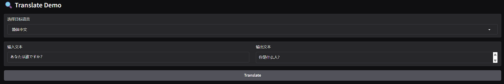
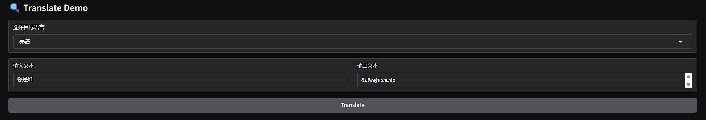

# Translate.axera
基于 [Qwen/Qwen2.5-1.5B-Instruct](https://huggingface.co/Qwen/Qwen2.5-1.5B-Instruct) 模型的 实现多国语言互译。

## 编译
```shell
./build.sh          # 本地编译
./build_aarch64.sh  # aarch64 交叉编译
```

## 模型获取
[Qwen2.5-1.5B-Instruct](https://huggingface.co/AXERA-TECH/Qwen2.5-1.5B-Instruct)

## 配置文件
根据模型下载路径修改
```json
{
    "template_filename_axmodel": "qwen2.5-1.5b-ctx-ax650/qwen2_p128_l%d_together.axmodel",
    "axmodel_num": 28,
    "url_tokenizer_model": "./tests/tokenizer/qwen2_5_tokenizer.txt",
    "filename_post_axmodel": "qwen2.5-1.5b-ctx-ax650/qwen2_post.axmodel",
    "filename_tokens_embed": "qwen2.5-1.5b-ctx-ax650/model.embed_tokens.weight.bfloat16.bin",
    "tokens_embed_num": 151936,
    "tokens_embed_size": 1536,
    "use_mmap_load_embed": 1
}
```

## 用例

### C++
```shell
./test_translate -c config.json -t "hello,world!"
output: 你好，世界！
```

### Gradio
```shell
python gradio_example.py --config ../build/config.json 
```




### HTTP API
#### 启动服务
```shell
./translate_svr -c config.json -h 0.0.0.0 -p 8080
listen on http://0.0.0.0:8080
```
#### 调用服务
```shell
./translate_cli -h 0.0.0.0 -p 8080 -i "hello,world!" -t target_chs
{"input":"hello,world!","output":"你好，世界！","target":"target_chs"}
你好，世界！
```
## 社区
QQ 群: 139953715