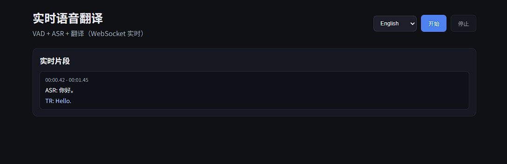
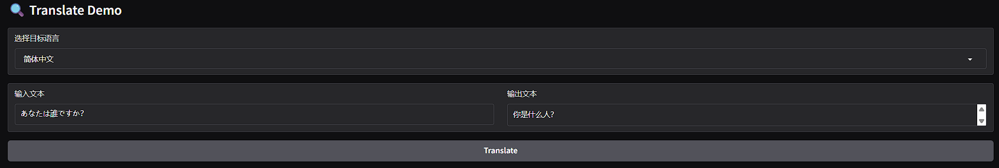
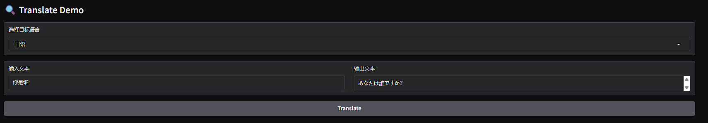
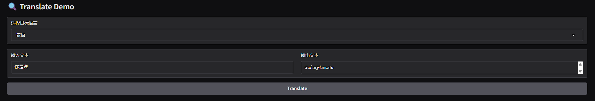

# Translate.axera
基于大语言模型的多国语言互译 SDK（AX650 / AXCL 双端）。

## 编译
```shell
./build_ax650.sh         # AX650 交叉编译
./build_axcl_x86.sh      # AXCL x86 编译
./build_axcl_aarch64.sh  # AXCL aarch64 交叉编译
```
编译成功之后 build目录应有以下文件
```
(base) axera@dell:~/libtranslate.axera/build_axcl$ tree
.
├── CMakeCache.txt
├── libax_translate.so
├── Makefile
├── test_translate # 测试用例
├── translate_cli  # 调用服务用例
└── translate_svr  # 服务端程序
```

## 模型获取
[HY-MT1.5-1.8B_GPTQ_INT4](https://huggingface.co/AXERA-TECH/HY-MT1.5-1.8B_GPTQ_INT4)
```
hf clone AXERA-TECH/HY-MT1.5-1.8B_GPTQ_INT4 --local-dir ./HY-MT1.5-1.8B_GPTQ_INT4
```

### VAD/ASR (ax_meeting)
模型来源：`https://huggingface.co/AXERA-TECH/3D-Speaker-MT.Axera`

## 用例

### C++
```shell
./test_translate -m /path/to/HY-MT1.5-1.8B_GPTQ_INT4 -t "hello,world!" -l "Chinese"
output: 你好，世界！
```

### Web 实时翻译
```shell
./run_web_rt.sh
```
访问 `https://<设备IP>:8001`（自签证书首次需要手动信任）。
可选环境变量：
```shell
TRANS_MODEL_DIR=/path/to/HY-MT1.5-1.8B_GPTQ_INT4 \
PORT=8001 HOST=0.0.0.0 \
./run_web_rt.sh
```


### Gradio
```shell
python pytranslate/gradio_example.py --model_dir /path/to/HY-MT1.5-1.8B_GPTQ_INT4
```




### HTTP API
#### 启动服务
```shell
./translate_svr -m /path/to/HY-MT1.5-1.8B_GPTQ_INT4 -h 0.0.0.0 -p 8080
listen on http://0.0.0.0:8080
```
#### 调用服务
```shell
./translate_cli -h 0.0.0.0 -p 8080 -i "hello,world!" -l "Chinese"
{"input":"hello,world!","output":"你好，世界！","language":"Chinese"}
你好，世界！
```
## 社区
QQ 群: 139953715
